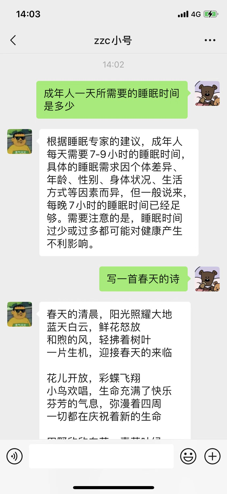

## 基于 openai chatgpt gpt-3.5-turbo wechaty 的微信智能聊天机器人

### 接入前准备工作
- 一个微信小号
- 在 [openai](https://platform.openai.com/account/api-keys) 获取一个api-keys 有免费额度

### 接入微信
1. 下载项目中的docker-compose.yml文件
2. 添加相关参数
- PORT: 项目启动地址
- CHATGPT_API_URL: openai api服务地址 默认 https://api.openai.com 有时可能无法访问使用国内域名进行代理亲测有效
- OPENAI_API_KEY: 在openai 官网申请的的api key
- REPLY_FRIEND: 是否使用chatgpt回复私聊好友，true或者false
- REPLY_GROUP: 是否使用chatgpt回复群组@的消息，true或者false
- GROUPS: 开启chatgpt 消息的群组名称 如：群组1,群组2,群组3, 如为空则所有群组@消息均会回复

3. 执行docker-compose up -d 
4. 打开手机扫二维码即可开始接入ChatGPT

